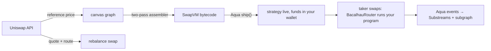

# QilinSwap

Compose your own market-making strategy from visual blocks, ship it from your
wallet, and watch it live — no code, no deployed contracts.

Built at ETHGlobal Lisbon 2026.

## What it is

A strategy is a **control-flow graph**, not a form. SwapVM's run loop re-reads
the program counter after every instruction, so any instruction can branch:

- **quote asymmetrically per side** — cheap for takers who sell you ETH,
  expensive for takers who buy it
- **switch behaviour on inventory** — accumulate until you hold 70% ETH, then
  flip to distributing it

You draw that graph, it compiles to SwapVM bytecode, and it ships to Aqua from
your own wallet. Funds never move until a taker swaps.

**None of this is new capability** — a Uniswap v4 hook can do all of it, and
more. What changes is where the strategy lives. A hook is a contract you write,
deploy and are responsible for, and its rules bind every LP in the pool. Here
the strategy is *data*: bytecode interpreted by an already-deployed, audited VM,
authored per-maker, so two makers on the same pair can run opposite strategies
against liquidity that never leaves their wallets. Changing it is a re-ship, not
a redeploy.

The bet is that the barrier to custom market making was never expressiveness —
it was having to ship a contract to express anything at all.



## Run it

One command brings up the whole demo — a Base fork, the deployed contracts with
a seeded strategy, and the app:

```bash
nix run .#dev
```

Then open <http://localhost:5173>. `q` (or Ctrl-C) stops everything; processes
shut down in reverse dependency order, so nothing is left listening.

It runs three processes, wired by readiness so the app never starts before the
deployment exists:

| Process  | What it does                                                        |
| -------- | ------------------------------------------------------------------- |
| `anvil`  | Forks Base, so real WETH/USDC and Uniswap pools are available        |
| `deploy` | Deploys Aqua + BacalhauRouter, ships the seed strategy, writes addresses |
| `app`    | Vite dev server                                                     |

Fork a different upstream with `BASE_RPC_URL=… nix run .#dev`. To drive the
pieces separately — say to restart the frontend without redeploying — use
`nix develop`, then `./scripts/demo-env.sh` and `cd app && pnpm dev`.

## Deploy the demo

The public build is a Nix derivation, so the artifact is identical locally and
in CI:

```bash
nix build .#site     # -> ./result, a self-contained Cloudflare Pages root
nix run  .#deploy    # builds the above, then uploads it with wrangler
```

`nix run .#deploy` is the entire deploy — GitHub Actions runs the same command
and only adds credentials (`.github/workflows/deploy.yml`). It reads:

| Variable                | Purpose                                          |
| ----------------------- | ------------------------------------------------ |
| `CLOUDFLARE_API_TOKEN`  | wrangler auth (or run `wrangler login` once)      |
| `CLOUDFLARE_ACCOUNT_ID` | wrangler auth                                     |
| `UNISWAP_API_KEY`       | pushed as a Pages secret when set; optional       |
| `CF_PAGES_PROJECT`      | Pages project name, defaults to `bacalhau`        |

The Uniswap Trading API sends no CORS headers and its key must not reach the
browser, so every `/uniswap/*` call goes through a same-origin proxy that
attaches the key server-side: the Vite dev server locally, `app/public/_worker.js`
on Cloudflare. Nothing secret is passed into the build — with no key configured
the proxy answers 503 and the app simply hides the live market overlay.

## Where the integrations live

Pointers to the exact code, for anyone verifying a track submission.

### 1inch — Aqua + SwapVM

| What | Where |
| ---- | ----- |
| Custom opcode `0x22` `_inventorySkewXD` — tilts the quote toward a target inventory split | [`contracts/src/InventorySkew.sol`](contracts/src/InventorySkew.sol) |
| Custom opcode `0x23` `_jumpIfInventoryAboveXD` — direction-independent state predicate, the branch that makes a strategy a state machine | [`contracts/src/InventoryBranch.sol`](contracts/src/InventoryBranch.sol) |
| The allowed modified-SwapVM redeploy: official `AquaOpcodes` table with both instructions appended | [`contracts/src/BacalhauRouter.sol`](contracts/src/BacalhauRouter.sol) |
| Graph → bytecode assembler. Emits jump labels only at instruction boundaries, and enforces the audited order on every path | [`app/src/compiler/graph.ts`](app/src/compiler/graph.ts) |
| Bytecode parity with the Solidity fixture, jump-target safety, 200-graph property test | [`app/src/compiler/graph.test.ts`](app/src/compiler/graph.test.ts), [`contracts/test/GoldenPrograms.t.sol`](contracts/test/GoldenPrograms.t.sol) |

Official contracts are consumed as submodules (`lib/aqua`, `lib/swap-vm`);
instructions are **appended** to the opcode table, never inserted, so existing
bytecode keeps its meaning — [`contracts/test/InventoryBranch.t.sol`](contracts/test/InventoryBranch.t.sol)
pins that with a program using both custom opcodes at once.

### Uniswap — Trading API

| What | Where |
| ---- | ----- |
| Reference price behind the strategy curve, with a freshness contract | [`app/src/lib/uniswap.ts`](app/src/lib/uniswap.ts) |
| Rebalance: quote → approve → execute, fee tier parsed from the API's own `routeString` | [`app/src/lib/rebalance.ts`](app/src/lib/rebalance.ts) |
| Same-origin proxy attaching the key server-side | [`app/public/_worker.js`](app/public/_worker.js), [`app/vite.config.ts`](app/vite.config.ts) |

Integration notes, including why execution calls SwapRouter02 directly instead
of submitting the API's Permit2 calldata: [`FEEDBACK.md`](FEEDBACK.md).

### The Graph — Substreams + subgraph

| What | Where |
| ---- | ----- |
| Reusable Substreams module decoding Aqua's `Shipped`/`Docked`/`Pulled`/`Pushed` | [`substreams/`](substreams/) |
| Subgraph over the same events, deployed and indexing Base Sepolia | [`subgraph/`](subgraph/) |
| Dashboard panel reading the live endpoint | [`app/src/lib/subgraph.ts`](app/src/lib/subgraph.ts) |

**What composability bought us:** Aqua had no indexer at all, so both products
start from the same decode. The Substreams module is the reusable half — it emits
a typed `Events` stream any sink can consume, and a `graph_out` that speaks
graph-node's entity-change protocol — while the subgraph is the queryable half
the dashboard uses. Adding a second consumer (a Postgres or ClickHouse sink) now
means pointing it at the existing `.spkg`, not re-deriving Aqua's event layout.
Live data is real, not mocked: we generated the on-chain traffic ourselves
([`contracts/script/SepoliaSwaps.s.sol`](contracts/script/SepoliaSwaps.s.sol))
because Aqua has no organic testnet volume yet.

## Specs

- [01 — Product overview](docs/01-product-overview.md)
- [02 — User flows](docs/02-user-flows.md)
- [03 — Screens](docs/03-screens.md)
- [04 — Hackathon constraints & sponsor mapping](docs/04-hackathon-constraints.md)
- [05 — Block catalog](docs/05-block-catalog.md)
- [06 — Data model & metrics](docs/06-data-and-metrics.md)
- [07 — Demo script](docs/07-demo-script.md)
- [08 — Assumptions, risks & cut plan](docs/08-assumptions-risks.md)
- [09 — Architecture](docs/09-architecture.md)
- [Backlog (deferred ideas)](docs/backlog.md)

Sponsor-facing: [`FEEDBACK.md`](FEEDBACK.md) — how integrating the Uniswap API
actually went.
