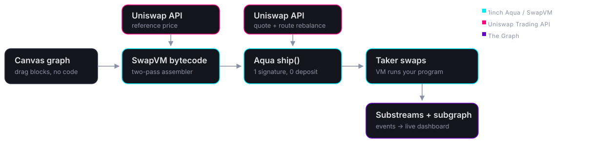
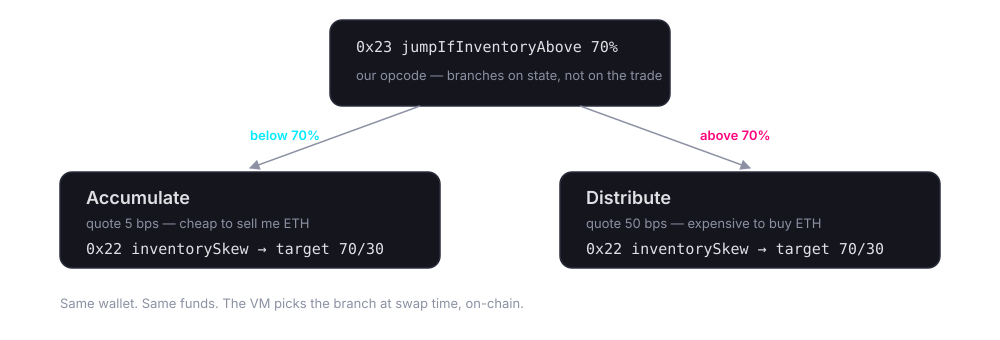

<!-- .slide: data-background-image="keyart.jpg" data-background-opacity="0.35" -->

# QilinSwap

### Compose a market-making strategy from visual blocks.<br/>Ship it from your wallet. Never deploy a contract.

<small class="muted">ETHGlobal Lisbon 2026 · 1inch · Uniswap · The Graph</small>

Note:
15s. Zero code, zero contracts, funds never leave the maker's wallet.

---

## The barrier was never expressiveness

<div class="two">
<div>

**Today** — anything custom means shipping a contract.<br/>
A v4 hook can do all of this, and more.

</div>
<div>

**Here** — the strategy is *data*: bytecode run by an already-audited VM.<br/>
Per-maker, not per-pool. Changing it is a re-ship, not a redeploy.

</div>
</div>

Note:
20s. Concede the hook comparison immediately, then land the difference: per-maker vs per-pool.

---

## One pipeline, three sponsors



Note:
25s. Left to right: the whole product in one line.

---

## 1inch — we extended the VM

<div class="two">
<div>

`0x22` **inventorySkew** — tilts the quote toward a target split

`0x23` **jumpIfInventoryAbove** — the state branch that makes a strategy a *state machine*

</div>
<div>

Official Aqua + SwapVM as submodules.<br/>
Instructions **appended** to the opcode table, never inserted — existing bytecode keeps its meaning.

Golden bytecode vector pinned identically in Solidity **and** TypeScript.

</div>
</div>

Note:
30s. Branching on the trade is easy; branching on state needed an instruction that didn't exist.

---



Note:
20s. This is the money shot in the demo: cross 70%, the same quote gets worse.

---

## Uniswap — market truth, live

<div class="two">
<div>

**Reference price** behind the strategy curve, with a freshness contract

**Rebalance**: quote → approve → execute, fee tier parsed from the API's own `routeString`

</div>
<div>

The key never reaches the browser: a same-origin proxy attaches it server-side — Vite in dev, a Cloudflare Worker in prod.

No key configured → 503 → the app just hides the overlay.

</div>
</div>

Note:
25s. Real Base liquidity, not a mock.

---

## The Graph — Aqua had no indexer

<div class="two">
<div>

**Substreams module** decoding `Shipped` / `Docked` / `Pulled` / `Pushed` — the reusable half

**Subgraph** over the same events — the queryable half the dashboard reads

</div>
<div>

Both start from one decode. A second sink means pointing at the existing `.spkg`, not re-deriving Aqua's event layout.

Data is real: we generated the Base Sepolia traffic ourselves.

</div>
</div>

Note:
25s.

---

## Reproducible by construction

```bash
nix run .#dev      # Base fork + contracts + seeded strategy + app
nix run .#deploy   # the entire production deploy, same command in CI
```

<small class="muted">The build is a Nix derivation — the artifact is byte-identical locally and in CI.</small>

Note:
10s. Optional, drop it if time is short.

---

<!-- .slide: data-background-color="#00ebfc" -->

<h1 class="dark">DEMO</h1>

<p class="dark">draw it · ship it · flip it on-chain · rebalance</p>

Note:
Beats: template → 0x23 branch → ship → swap 6 WETH, quote gets worse → Uniswap rebalance → Graph panel.

---

<!-- .slide: data-background-image="keyart.jpg" data-background-opacity="0.35" -->

## Liquidity strategies<br/>for people who don't write Solidity

<small class="muted">github.com/AdCazzum/qilinswap</small>

Note:
Close and stop talking.
